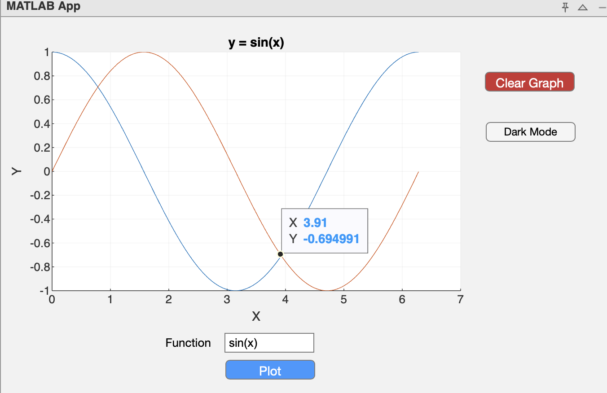
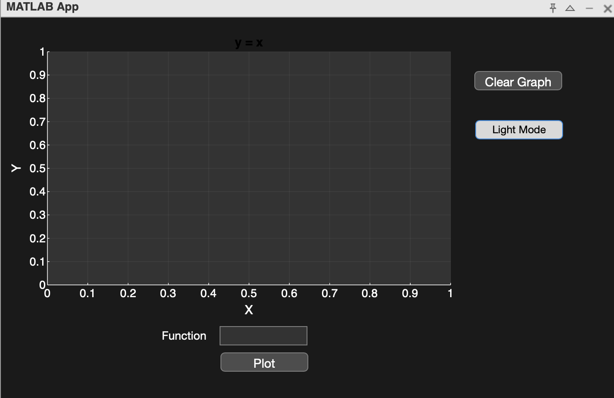

# Graph Plotter App

This MATLAB-based application allows users to input mathematical functions, plot them on a graph, and interact with the graph to display the coordinates of any selected points.

## Features

- **Dynamic Plotting:** Input mathematical functions, and the app will generate a plot with real-time updates.
- **Interactive Graph:** Click on the graph to get the coordinates of points.
- **Clear Functionality:** Easily clear the graph to start a new input.

## Installation

1. Ensure that you have MATLAB R2021 or later installed on your machine.
2. Download the `graphplotter.mlapp` file.
3. Open the MATLAB app by double-clicking the `graphplotter.mlapp` file or loading it in the MATLAB environment.

## Usage

1. Open the Graph Plotter app in MATLAB.
2. Enter a mathematical function (e.g., `sin(x)` or `cos(x)`) into the input box.
3. The graph will update dynamically to display the function.
4. Click anywhere on the plot to view the coordinates of the point.
5. Use the **Clear** button to reset the plot and start over.

## Example

- **Input:** `y = cos(x)`
- **Output:** A graph displaying the cosine wave.

## Screenshots

Here are some screenshots of the Graph Plotter App in action:

## Known Issues

- The app works best for simple functions. Complex functions might not render correctly.

## Contributing

Feel free to fork this repository, make improvements, or report any issues you encounter. Pull requests are welcome!

## License

This project is licensed under the MIT License - see the LICENSE file for details.
